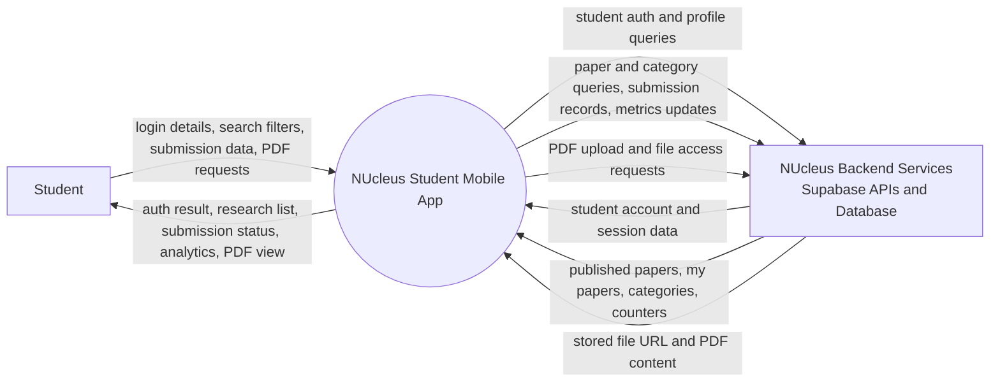

# Context Level Diagram (DFD Level 0) - Student Mobile

## Description

This context diagram presents the student mobile app as a single process that sits between one human actor (Student) and one external system boundary (NUcleus backend services on Supabase).

- Student to app flows represent user-triggered actions: login, searching, submitting research metadata and PDF files, and opening documents.
- App to student flows represent app responses: authentication outcomes, paper lists, submission status, and rendered content.
- App to backend flows are grouped into three data domains:
    - account and session operations,
    - research content operations,
    - file storage and retrieval operations.

In short, the diagram communicates that the mobile app orchestrates all student-facing behavior while delegating persistence and file handling to Supabase.

## Code Alignment (Student Scope)

- The app process boundary is implemented in Flutter through the app shell and route system.
    - lib/app.dart
    - lib/routes/app_routes.dart
- Student actor constraints are enforced at login. Non-student roles are blocked from entering the mobile home flow.
    - lib/presentation/screens/auth/login_screen.dart
- Backend interaction is centralized in the Supabase service layer.
    - lib/data/services/supabase_service.dart

## Accuracy Notes

- The diagram is accurate as a system boundary view.
- The backend box is intentionally high-level and combines API, database, and storage concerns into one external entity.
- Analytics in the student UI are derived from fetched paper counters in the app layer rather than a separate analytics endpoint.
    - lib/presentation/screens/research/analytics_screen.dart
