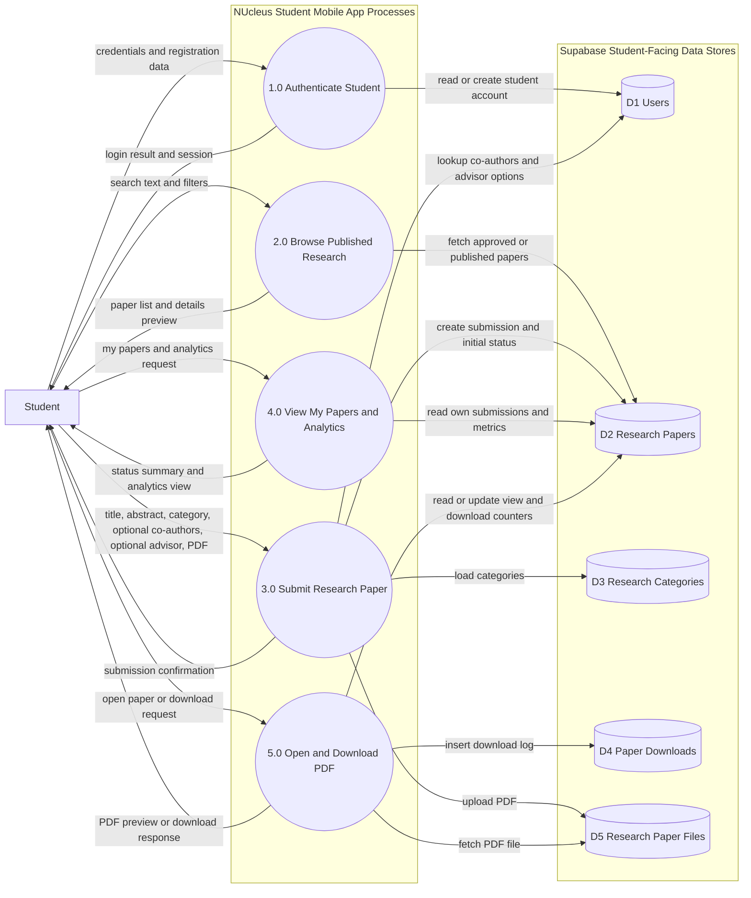

# DFD Level 1 - Student Mobile

## Description

This Level 1 DFD decomposes the mobile app into five student-facing processes and shows how each process exchanges data with Supabase data stores.

- Process 1.0 authenticates students and manages session-related account reads and writes.
- Process 2.0 retrieves approved or published papers for exploration.
- Process 3.0 orchestrates submission: reference data loading, file upload, and paper record creation.
- Process 4.0 returns student-owned papers and analytics summaries.
- Process 5.0 handles PDF opening and download-related updates.

The key structural idea is process-to-store mapping: each app process touches only the stores needed for that student use case.

## Data Store Mapping To Code

- D1 Users
    - Authentication and profile lookups.
    - Co-author and faculty lookup sources.
    - lib/data/services/supabase_service.dart
- D2 Research Papers
    - Browse reads, my papers reads, submission inserts, status and counters.
    - lib/data/services/supabase_service.dart
- D3 Research Categories
    - Submit form category options.
    - lib/data/services/supabase_service.dart
- D4 Paper Downloads
    - Download log inserts.
    - lib/data/services/supabase_service.dart
- D5 Research Paper Files
    - PDF storage upload and file URL usage.
    - lib/data/services/supabase_service.dart

## Accuracy Notes

- The decomposition is accurate for the student app flow in:
    - lib/presentation/screens/home/home_screen.dart
- Process 4.0 is shown as one process in the diagram, but is implemented as two tabs:
    - lib/presentation/screens/research/my_research_screen.dart
    - lib/presentation/screens/research/analytics_screen.dart
- Process 5.0 is architecturally correct, but download tracking methods are currently defined in repository and service layers and are not directly invoked by the current research detail screen interaction path.
    - lib/data/repositories/research_repository.dart
    - lib/data/services/supabase_service.dart
    - lib/presentation/screens/research/research_detail_screen.dart
