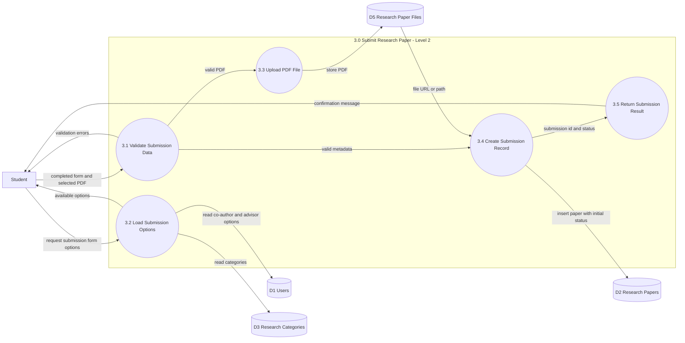

# DFD Level 2 - Submit Research Paper

## Description

This Level 2 DFD details Process 3.0 (Submit Research Paper) by breaking it into five sub-processes.

- 3.2 Load Submission Options reads categories plus user lists for advisor and co-author selection.
- 3.1 Validate Submission Data checks metadata completeness and PDF constraints.
- 3.3 Upload PDF File stores the selected PDF and returns a file path or URL.
- 3.4 Create Submission Record inserts the research paper row with workflow status.
- 3.5 Return Submission Result sends success feedback to the student.

The diagram emphasizes a gated flow: invalid data returns to the student immediately, while valid data continues to upload and persistence.

## Code Alignment (Student Submit Flow)

- Options loading:
    - lib/presentation/screens/research/submit_research_screen.dart
    - lib/data/repositories/research_repository.dart
    - lib/data/services/supabase_service.dart
- Validation checks in UI:
    - required category
    - title minimum length
    - abstract minimum length
    - PDF-only and max file size checks
    - lib/presentation/screens/research/submit_research_screen.dart
- File upload plus record insert:
    - lib/data/services/supabase_service.dart
- Workflow status assignment:
    - faculty selected -> pending_faculty
    - no faculty -> pending_editor
    - lib/data/services/supabase_service.dart

## Accuracy Notes

- The diagram is aligned with the implemented submit lifecycle.
- In code, upload and insert are executed sequentially inside one service call, while the diagram presents them as separate logical sub-processes.
- The process numbering order is presentation-oriented; in runtime, options are loaded on screen init, then validation occurs on submit.
