# HIPO Diagram - Student Mobile

```mermaid
flowchart TB
    A[NUcleus Student Mobile App]

    A --> M1[1.0 Student Authentication]
    A --> M2[2.0 Browse Published Research]
    A --> M3[3.0 Submit Research Paper]
    A --> M4[4.0 My Papers and Analytics]
    A --> M5[5.0 View and Download PDF]

    subgraph H1[1.0 Student Authentication - IPO]
        I1[/Input: Email, Password, Registration Data/]
        P1[Process: Validate input, verify account, enforce student role, create local session]
        O1[/Output: Auth success and student session OR error message/]
        I1 --> P1 --> O1
    end

    subgraph H2[2.0 Browse Published Research - IPO]
        I2[/Input: Search query, search scope, filter selection/]
        P2[Process: Fetch approved papers, apply search and filters, sort results]
        O2[/Output: Filtered paper list and metadata for student view/]
        I2 --> P2 --> O2
    end

    subgraph H3[3.0 Submit Research Paper - IPO]
        I3[/Input: Title, Abstract, Category, Department, Optional co-authors, Optional faculty advisor, PDF file/]
        P3[Process: Validate form and PDF, upload file, create research record, assign initial workflow status]
        O3[/Output: Submission confirmation and new pending paper entry/]
        I3 --> P3 --> O3
    end

    subgraph H4[4.0 My Papers and Analytics - IPO]
        I4[/Input: Student request for my papers and analytics/]
        P4[Process: Retrieve own submissions, compute status counts, summarize views and downloads]
        O4[/Output: My papers list, status overview, analytics summary/]
        I4 --> P4 --> O4
    end

    subgraph H5[5.0 View and Download PDF - IPO]
        I5[/Input: Selected paper from browse or my papers/]
        P5[Process: Open detail view, load PDF preview, open full viewer, track download event]
        O5[/Output: PDF shown to student and updated usage metrics/]
        I5 --> P5 --> O5
    end

    M1 -.details.-> H1
    M2 -.details.-> H2
    M3 -.details.-> H3
    M4 -.details.-> H4
    M5 -.details.-> H5
```

## Description

This HIPO diagram gives a functional hierarchy of the student mobile app and, for each module, summarizes Input, Process, and Output.

- Top hierarchy node: the NUcleus Student Mobile App.
- Five child modules reflect the core student feature set:
    - authentication,
    - published paper browsing,
    - submission,
    - my papers and analytics,
    - PDF viewing.

The dotted links from M1 to M5 into H1 to H5 represent drill-down from high-level modules to module-level IPO definitions.

## IPO Interpretation Against Current App

- 1.0 Student Authentication
    - Implemented through login and register screens and auth repository/service stack.
    - lib/presentation/screens/auth/login_screen.dart
    - lib/presentation/screens/auth/register_screen.dart
- 2.0 Browse Published Research
    - Implemented by the browse tab with search and filtering over published paper data.
    - lib/presentation/screens/research/browse_research_screen.dart
- 3.0 Submit Research Paper
    - Implemented by the submit screen and Supabase insert/upload pipeline.
    - lib/presentation/screens/research/submit_research_screen.dart
- 4.0 My Papers and Analytics
    - Implemented by separate tabs for paper list and aggregated counters.
    - lib/presentation/screens/research/my_research_screen.dart
    - lib/presentation/screens/research/analytics_screen.dart
- 5.0 View and Download PDF
    - Implemented by research detail plus in-app or web PDF viewing.
    - lib/presentation/screens/research/research_detail_screen.dart

## Accuracy Notes

- The HIPO hierarchy is accurate for student-facing features.
- Module 4.0 groups two separate implementations (my papers and analytics) under one functional module, which is appropriate at HIPO level.
- Module 5.0 output mentions updated usage metrics; the tracking primitives exist in service and repository layers, but direct invocation from current detail-screen interaction should be treated as implementation-dependent.
