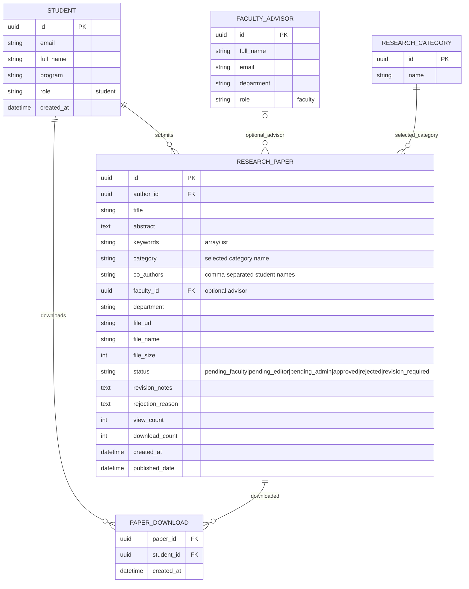

# ERD - Student Mobile

## Description

This ERD models the student-side research domain: who submits papers, how papers are categorized, how optional advisors are linked, and how download events are logged.

Main relationship intent:

- One student can submit many research papers.
- One faculty advisor can be assigned to many papers, but assignment is optional per paper.
- One category can label many papers.
- Download activity is tracked as a many-to-many event bridge between students and papers over time.

## Entity Mapping To Current Code

- STUDENT and FACULTY_ADVISOR are represented in code as role-based views over user records.
    - lib/data/models/user_model.dart
    - lib/data/models/faculty_member_model.dart
- RESEARCH_CATEGORY is represented by:
    - lib/data/models/category_model.dart
- RESEARCH_PAPER is represented by:
    - lib/data/models/research_model.dart
- PAPER_DOWNLOAD is persisted through service calls:
    - lib/data/services/supabase_service.dart

## Field And Relationship Accuracy Notes

- The ERD is functionally aligned with app data usage.
- STUDENT and FACULTY_ADVISOR are shown as separate conceptual entities for clarity, while implementation uses role-filtered user rows.
- RESEARCH_PAPER.category is currently handled as a category name string in app payloads rather than a strict category id foreign key in Dart models.
    - lib/data/models/research_model.dart
    - lib/data/services/supabase_service.dart
- PAPER_DOWNLOAD naming differs slightly from diagram wording:
    - diagram attribute: student_id
    - current insert field in code: user_id
    - lib/data/services/supabase_service.dart
- Status workflow values shown in the diagram are consistent with constants and model display mapping.
    - lib/core/constants/app_constants.dart
    - lib/data/models/research_model.dart

## Student Scope Note

The ERD includes statuses that participate in broader approval flow stages. In this mobile scope, students primarily create submissions and observe resulting status values through their paper and analytics views.
